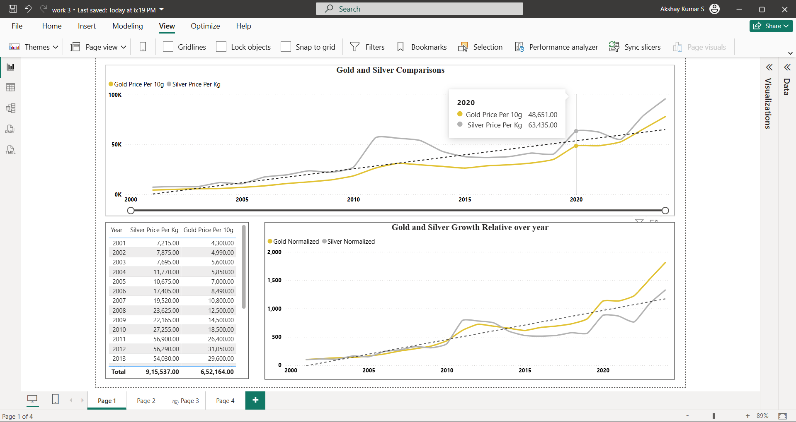
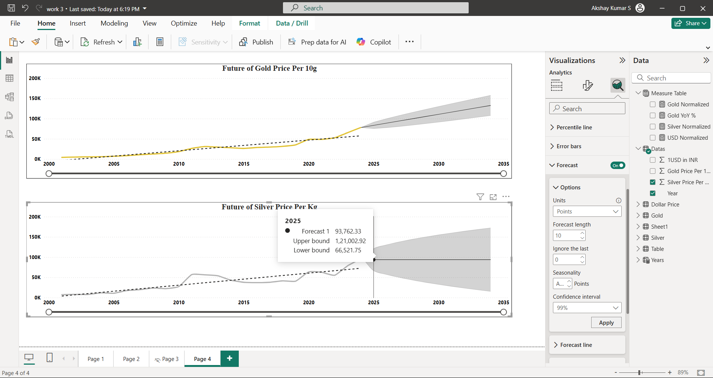

# 📊 Gold & Silver Price Trend Analysis (2001–2024) – Power BI Project  

## 📌 Project Overview  
This project analyzes the **historical price trends of Gold and Silver (2001–2024)** and their relationship. Using **Power BI**, I built dashboards to uncover insights about market behavior, global events, and long-term investment trends.  

The analysis focuses on **how global crises, currency fluctuations, and economic events impact commodity prices**, and demonstrates how data storytelling can explain the **“WHY” behind numbers**.  

---

## 🛠 Tools & Technologies  
- **Power BI** → Data cleaning, modeling, DAX, dashboards.  
- **Excel/CSV** → Historical price datasets (Gold, Silver, USD–INR).  
- **GitHub** → Project hosting & documentation.  

---

## 📂 Project Workflow  

1. **Data Collection**  
   - Extracted historical data for Gold (₹ per 10g), Silver (₹ per kg) from **2001 to 2024**.  

2. **Data Preparation**  
   - Cleaned and structured datasets.  
   - Normalized prices to compare relative growth over years.  
   - Created a **Date Table** for time intelligence calculations.  

3. **Data Modeling**  
   - Linked Gold, Silver tables using **Year** as a key.  
   - Built calculated columns and DAX measures for analysis.  

4. **Analysis & DAX Measures**  
   - **Year-over-Year % Change** in Gold and Silver prices.  
   - **Normalized Growth Index (Base Year 2001 = 100)** to compare relative growth.  
   - Forecasting trend lines to project future price movements.  
   - Example DAX:  
     ```DAX
     Normalized Gold = 
     DIVIDE(
        AVERAGE(Gold[Price_per_g]), 
        CALCULATE(AVERAGE(Gold[Price_per_g]), FIRSTDATE(Gold[Year]))
     ) * 100
     ```  

5. **Visualization (Power BI)**  
   - Line chart: Gold vs Silver trends over years.  
   - Index chart: Growth comparison (2001 baseline).  
   - Forecast chart: Projecting future trends (Gold rising vs Silver flattening).  

---

## 📸 Project Screenshots  

- **Gold vs Silver Price Trends (2001–2024)**  
    

- **Relative Growth (Normalized Index)**  
    


---

## ✨ Key Insights  

- **2008–2011:** Prices spiked due to the **Global Financial Crisis** as investors moved to safe-haven assets.  
- **2013–2015:** Prices fell after the **US Fed reduced stimulus**, strengthening the USD.  
- **2020:** COVID-19 crisis drove both Gold & Silver up again due to uncertainty.  
- **2021–2024:** Prices continue rising, influenced by inflation, geopolitical tensions, and currency depreciation.  
- Gold has shown ~18x growth since 2001, while Silver grew ~13x in the same period.  

---

## 📌 Conclusion  
- **Gold = Long-term stability** (steady safe-haven growth).  
- **Silver = Higher volatility** (industrial + safe-haven demand).  
- Historical data shows that global crises, inflation, and USD–INR directly impact both metals.  
- Forecasting suggests Gold may continue rising, while Silver remains more unpredictable.  

---

## 🎯 Key Learnings  
- Using **Power BI for financial data storytelling**.  
- Applying **DAX for YOY %, Normalization, Forecasting**.  
- Explaining data trends in the context of **global events**.  
- How analysts can connect data to **real-world decision-making**.  

---

## 🚀 How to Use This Project  
1. Clone this repository.  
2. Open the **Power BI file (.pbix)**.  
3. Explore dashboards & insights.  

---

## 🔗 Live Dashboard
[View on Power BI Service](https://app.powerbi.com/view?r=eyJrIjoiNTc1NTVmYjYtNjViNC00NDQ1LTliZmEtYTk1ZjZiOGY1NWEzIiwidCI6IjQyYzJjNGE0LTcyMTEtNGEwNC1hNTk4LWEyN2Q1YWIzMjY4MSJ9)

---

## 📌 Author  
👤 **Akshay Kumar S**  
- Aspiring **Data Analyst** | SQL | Power BI | Python | Excel  
- [LinkedIn Profile](www.linkedin.com/in/akshay-kumar-212002ak)  
- akshaysubramanian064@gmail.com  
